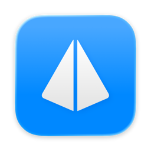
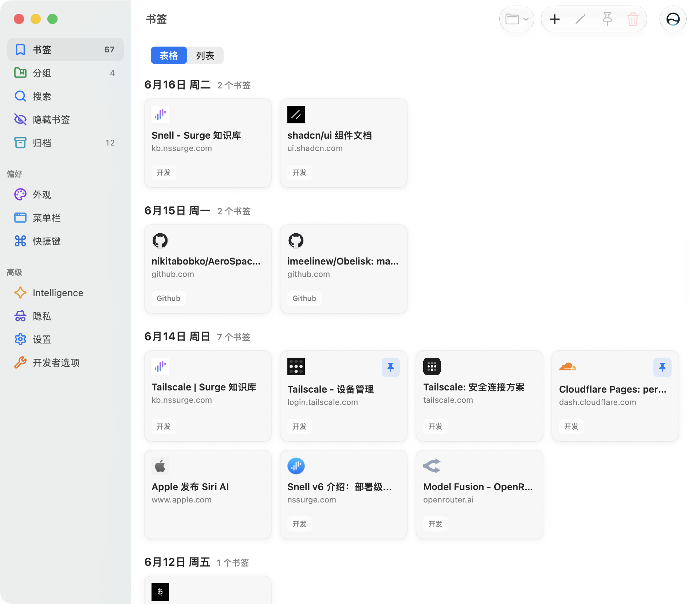
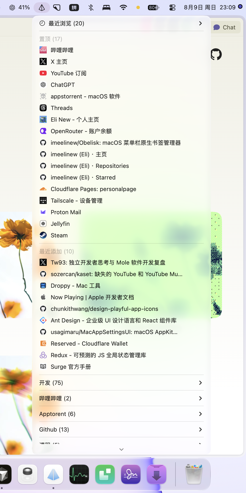
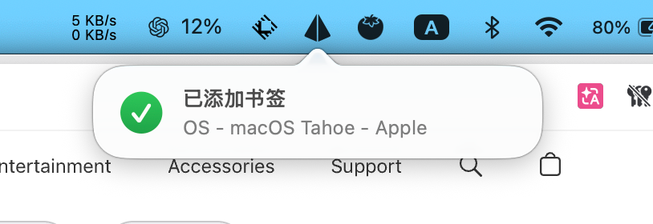

  

<h1 align="center">Obelisk</h1>

  A native macOS bookmark shelf that lives in your menu bar. 
  Fast access, local storage, private lists, and a quiet settings window.

  <a href="https://github.com/imeelinew/Obelisk/releases">Download</a> ·
  <a href="#install">Install</a> ·
  <a href="#build-from-source">Build from source</a>

  <a href="README.en.md">English</a>
  <a href="README.md">简体中文</a>

  
  
  
  

---

  

## About

Obelisk is a menu bar bookmark manager for people who want bookmarks close at hand without turning the browser into the center of everything.

It keeps a small native menu in the macOS menu bar, opens bookmarks quickly, and gives you a full settings window when you need to organize, hide, archive, or clean up titles. Bookmarks are stored locally on disk, with optional local encryption for private data.

## Why Obelisk

Browser bookmarks are usually tied to one browser, buried in sidebars, or mixed with sync accounts you may not want to use. Obelisk keeps the list outside the browser and makes it feel like a small system tool.

- **Menu bar first**: open frequent, recent, and full bookmark lists without switching context.
- **Native settings**: manage bookmarks in a macOS window with search, sections, and familiar toolbar controls.
- **Private lists**: keep hidden bookmarks behind device-owner authentication.
- **Local storage**: bookmark data lives under your local Documents folder.
- **Optional cleanup**: use AI title optimization when you want cleaner bookmark names.

## Menu Bar

  

The menu groups bookmarks by usage and recency, with the full list kept one level away.

## Quick Add

  

Use the global add-bookmark shortcut to save the current browser tab. Obelisk reads the frontmost browser's URL and title, then shows a compact confirmation so you know the bookmark landed.

## What's Inside

- Menu bar bookmark launcher with favicons
- Full bookmark management window
- Hidden bookmarks with local authentication
- Archive view for older or manually archived bookmarks
- Search, edit, delete, copy URL, and refresh favicon actions
- Configurable menu limits and window appearance
- Optional silent add flow
- Optional local JSON encryption for private storage
- Optional AI title optimization

## Install

Download the latest app from the [Releases page](https://github.com/imeelinew/Obelisk/releases), then move `Obelisk.app` to `/Applications`.

Obelisk is a menu bar app. After launching it, look for the Obelisk icon in the macOS menu bar.
